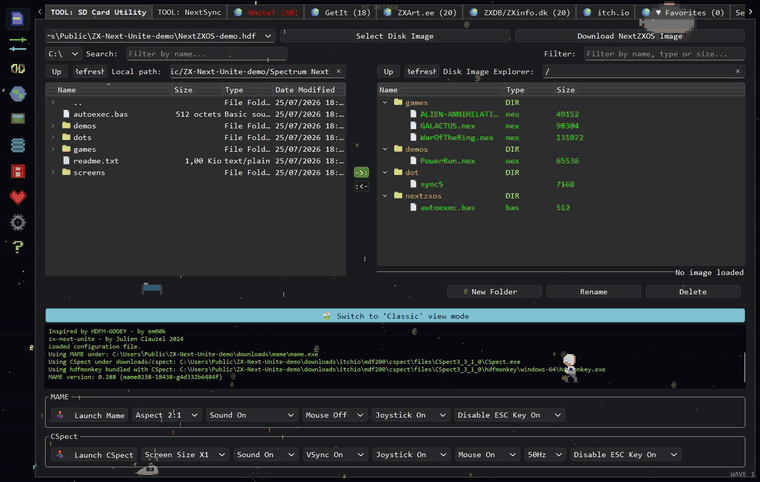
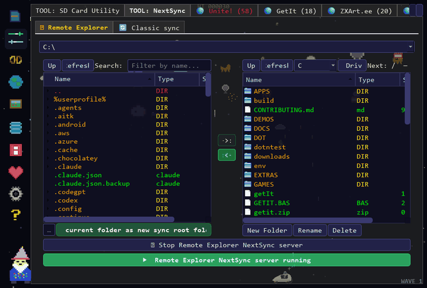
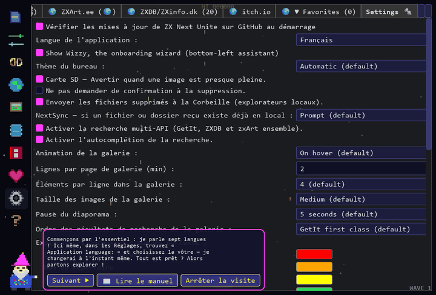
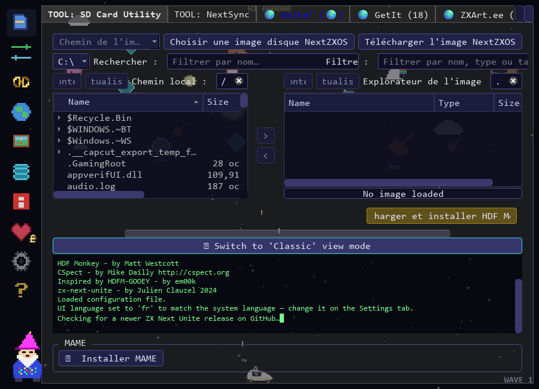

# ZX-Next-Unite

Cross-platform (Windows, Linux, macOS) desktop app for ZX Spectrum Next users.
It unites two great tools — **Hdfm-Gooey** and **NextSync** — in a single GUI,
and adds a built-in browser to discover ZX Spectrum / Spectrum Next software
across **GetIt**, **ZXDB/ZXInfo**, **zxArt** and **itch.io**.

By Julien Clauzel, based on **HDFM-GOOEY** by em00k and **NextSync** by Jari
Komppa (with the Sync4 extensions by Julien Clauzel).

Co-developed with the assistance of **Claude** (Anthropic's AI).

*The main tabs, in Retro mode: SD Card Utility · NextSync (classic sync, then
the Remote Explorer) · GetIt · ZXArt.ee · ZXDB/ZXInfo.dk · Unite! · Alien
Floyd's. Every tab is documented in the
**[User Manual](https://github.com/jclauzel/ZX-Next-Unite/wiki/User-Manual)**.*

## Showcase

**The Remote Explorer, live** — a real Spectrum Next's SD card browsed over
Wi-Fi from the app (the Next runs `.sync5 -l`): full two-pane file
management, both directions, remote zip/unzip included.

**Meet Wizzy** — the built-in onboarding wizard tours every tab, offers
in-depth guides for the SD Card and NextSync tools, speaks seven languages
(switching live with the app language), tells Speccy jokes — and walks like
an Egyptian:

**The SD Card Utility** in the dark "Next" chrome — PC on the left, the
mounted NextZXOS image on the right, drag & drop and clipboard both ways,
emulator launch buttons below:

## Features

- **SD Card tab** — mount an HDF image, copy files in/out with a built-in
  explorer, then launch **CSpect** or **MAME** directly. No emulator command
  lines to remember.
- **NextSync tab** — push files over Wi-Fi from your PC to a real Spectrum Next
  (KS1/KS2 or clones with an ESP module) using the `.sync5` dot command.
- ⭐ **Remote Explorer** — a two-pane file manager for your Next's **real
  filesystem over Wi-Fi**: browse, drag & drop, upload/download and manage files
  (new folder, delete) directly — no SD-card swapping. Run `.sync5 -listen` on
  the Next to connect, and launch the app with the
  `-start-remote-explorer-listener` switch to have the listen server running
  from startup with no clicks. See the
  [Wiki](https://github.com/jclauzel/ZX-Next-Unite/wiki#remote-file-explorer).
- ⭐ **HTTP bridge** — remote access to a Next's file system over plain **HTTP**:
  a built-in web server (Flask) republishes the Remote Explorer's `-listen`
  session as HTTP routes, so you can browse, download, upload and manage the
  Next's SD card from a browser, `curl` — or from **another Next** using the
  built-in `.http` dot command. Enable it in the Settings tab (the port —
  80 by default — is set in the box next to the toggle). See the
  [HTTP bridge documentation](nextsync/sync/server/HTTP_BRIDGE.md).
- **Online libraries** — search and download from GetIt, ZXDB/ZXInfo, zxArt and
  (optionally) itch.io.

## Quick start

**Windows:** download the latest `zx-next-unite-v9.x.x.exe` from the
[Releases](https://github.com/jclauzel/ZX-Next-Unite/releases) page — no Python needed.

**Linux (x86_64):** download `zx-next-unite-v9.x.x-linux-x86_64.tar.gz` from the
same page, extract it and run the binary inside.

**macOS (Apple Silicon):** download `zx-next-unite-v9.x.x-macos-arm64.zip`,
extract it and start the app. The app is not code-signed, so the first launch
needs right-click → Open (or `xattr -cr` on the .app) to get past Gatekeeper.

All three packages are built by CI from the tagged source
([release workflow](.github/workflows/release.yml)), and the app's built-in
update check offers the right package for your platform when a newer release
is published.

**Via pipx (any platform, from PyPI):**

    pipx install "zx-next-unite[full]"

installs the `zx-next-unite` command (plus the `nextsync5` command-line sync
server) in its own isolated environment — one line, no repo checkout. Drop
`[full]` to skip the optional extras (retro pygame views, itch.io tab,
Recycle-Bin deletes, HTTP bridge).

**From source (any platform):**

    git clone https://github.com/jclauzel/ZX-Next-Unite
    cd ZX-Next-Unite
    python -m pip install -r REQUIREMENTS.txt
    python zx-next-unite.py

Requires **Python 3.10 or newer** (the stock Python of Ubuntu 22.04 / Debian
12 and later works out of the box; CI runs the test suite on 3.10 and 3.13).
Use `python3` on Linux/macOS. Only **PySide6** is required; `pygame-ce`,
`itch-dl` and `flask` are optional (`flask` powers the NextSync HTTP bridge —
the web server that lets a Next drive another Next's SD card via the `.http`
dot command; without it the Settings toggle is simply greyed out).

## Documentation

Full setup, emulator / hdfmonkey / Mono configuration and troubleshooting are in
the **[Wiki](https://github.com/jclauzel/ZX-Next-Unite/wiki)**:

- [Home / overview](https://github.com/jclauzel/ZX-Next-Unite/wiki)
- [Installation](https://github.com/jclauzel/ZX-Next-Unite/wiki/Installation)
- 📖 **[User Manual](https://github.com/jclauzel/ZX-Next-Unite/wiki/User-Manual)**
  — **new:** a page per tab, with screenshots, aimed at first-time users. What
  each tab is for, a quick start, and a reference for every control:
  [SD Card Utility](https://github.com/jclauzel/ZX-Next-Unite/wiki/SD-Card-Utility-tab) ·
  [NextSync](https://github.com/jclauzel/ZX-Next-Unite/wiki/NextSync-tab) ·
  [Unite!](https://github.com/jclauzel/ZX-Next-Unite/wiki/Unite-tab) ·
  [GetIt](https://github.com/jclauzel/ZX-Next-Unite/wiki/GetIt-tab) ·
  [ZXArt.ee](https://github.com/jclauzel/ZX-Next-Unite/wiki/zxArt-tab) ·
  [ZXDB/ZXInfo.dk](https://github.com/jclauzel/ZX-Next-Unite/wiki/ZXDB-tab) ·
  [itch.io](https://github.com/jclauzel/ZX-Next-Unite/wiki/itch-io-tab) ·
  [Favorites](https://github.com/jclauzel/ZX-Next-Unite/wiki/Favorites-tab) ·
  [Alien Floyd's](https://github.com/jclauzel/ZX-Next-Unite/wiki/Alien-Floyds-tab) ·
  [Settings](https://github.com/jclauzel/ZX-Next-Unite/wiki/Settings-tab) ·
  [Help](https://github.com/jclauzel/ZX-Next-Unite/wiki/Help-tab)

## License

Released under the **MIT** license (see [LICENSE](LICENSE)). Built on
**PySide6** (Qt for Python, LGPL v3) and optionally **pygame-ce** (LGPL v2.1),
[itch-dl](https://github.com/DragoonAethis/itch-dl) by Dragoon Aethis (MIT),
[Flask](https://flask.palletsprojects.com/) by the Pallets team (BSD-3-Clause),
the web server that powers the NextSync HTTP bridge, and
[Send2Trash](https://github.com/arsenetar/send2trash) by Andrew Senetar and
contributors (BSD-3-Clause), which sends locally-deleted files to the system
Recycle Bin / Trash.

Provenance and license details for every third-party component — including
NextSync (Jari Komppa, Unlicense), HDFM-Gooey (em00k), hdfmonkey (GPL v3),
CSpect and MAME — are in
[THIRD-PARTY-NOTICES.md](THIRD-PARTY-NOTICES.md).

## Legal disclaimer — third-party content

> **The author of ZX-Next-Unite does NOT distribute any files, ROMs, games, demos, graphics, music, or any other content obtained through the GetIt, ZXDB, or zxArt integrations.**

All content is served exclusively by the respective third-party services listed above. ZX-Next-Unite acts solely as a frontend client that queries their public APIs and downloads files directly from the URLs those APIs return.

**It is the sole responsibility of the end user to ensure that any content they download or use through this application complies with the applicable copyright, licensing, and legal requirements in their jurisdiction.**

If in doubt, consult the terms of service of the relevant platform and seek appropriate legal advice before downloading or using any content.

The first time you open the GetIt, ZXDB, or zxArt pane, the application will display this disclaimer and ask you to acknowledge it. You can dismiss the dialog to continue using the pane; the dialog will reappear on the next visit until you check *"I agree and understand. Do not show this message again"*, at which point your acknowledgement is saved to `hdfg.cfg` and the dialog will not be shown again.
